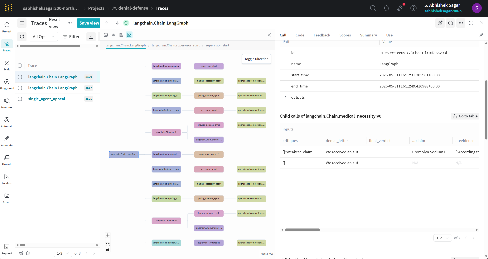
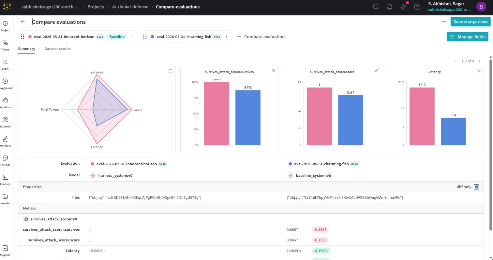

# Denial Defense

**Multi-agent AI system that writes insurance appeal letters using adversarial revision.**

We're open-sourcing this tonight because Americans shouldn't need a developer in the family to navigate their insurance.

---

## The Problem

Insurance companies deny necessary medical treatments. Patients write appeals, but:
- Don't know what arguments work
- Don't know relevant legal precedent  
- Can't predict insurer counterarguments

**Result:** 99% of denied claims are never appealed. [(KFF, 2023)](https://www.kff.org/private-insurance/issue-brief/claims-denials-and-appeals-in-aca-marketplace-plans/)

---

## Our Solution

A multi-agent AI system that generates appeal letters **already battle-tested against adversarial attacks**.

### Architecture

**5 AI agents working in 2 rounds:**

1. **Round 1 (Parallel):**
   - Medical Necessity Agent → Clinical evidence
   - Policy Citation Agent → Criteria matching
   - Precedent Agent → IMR case law

2. **Adversarial Critic:**
   - Simulates insurer's medical reviewer
   - Attacks the weakest argument

3. **Round 2 (Revision):**
   - Agents revise to address critique
   - Critic attacks again

4. **Supervisor:**
   - Synthesizes final appeal from strongest arguments

**The letter you get is a third draft that already survived two attacks.**



Each run is fully traced in W&B Weave: three patient agents fan out in parallel, the insurer critic attacks, agents revise, and the supervisor synthesizes the final appeal.

---

## Proof: 100% vs 87%

We evaluated both systems on **15 real California DMHC denial cases**. An adversarial judge (GPT-4o-mini playing insurer medical reviewer) tried to re-attack each appeal.



**Results:**
- **Multi-Agent Harness:** 15/15 passed (100%)
- **Single-Agent Baseline:** 13/15 passed (87%)
- **Improvement:** +13 percentage points

The multi-agent system with adversarial revision produces appeals that are **measurably more robust** to insurer counterarguments.

---

## Quick Start

### Prerequisites
- Python 3.9+
- OpenAI API key
- Weights & Biases account (free)

### Install

```bash
git clone https://github.com/SandaAbhishekSagar/denial-defense.git
cd denial-defense
pip install -r requirements.txt
```

### Configure

```bash
# Create .env file
cp .env.example .env

# Add your API keys to .env
OPENAI_API_KEY=your_openai_key_here
WANDB_API_KEY=your_wandb_key_here
```

### Run Demo

```bash
python web/app.py
# Open http://localhost:5000
```

**Try it:**
1. Toggle "Show side-by-side comparison" ON
2. Click "Oscar Health — Cromolyn for MCAS"
3. See baseline (left) vs harness (right) after ~25 seconds

---

## Demo Cases

Three real denial scenarios:

1. **Oscar Health — Cromolyn for MCAS**  
   Pharmacy denial for mast cell activation syndrome treatment

2. **Cigna — Spinal Cord Stimulator Trial**  
   Medical necessity denial for chronic pain management device

3. **Anthem — Residential SUD with MHPAEA Parity**  
   Mental health parity violation for substance use disorder treatment

---

## Project Structure

```
denial-defense/
├── agents/
│   ├── baseline.py         # Single-agent comparison
│   ├── harness.py          # Multi-agent orchestrator (LangGraph)
│   ├── prompts.py          # System prompts for all 6 agents
│   └── playbook.py         # CARC denial codes + federal protections
├── data/
│   ├── demo/               # 3 demo cases (JSON)
│   └── processed/          # Denial playbook (10 CARC codes)
├── eval/
│   └── compare_eval.py     # Weave evaluation script
├── web/
│   ├── app.py              # Flask backend
│   └── templates/          # UI with comparison mode
└── requirements.txt
```

---

## Key Features

### 1. Adversarial Revision Loop
Unlike ChatGPT/Claude (single draft), our system:
- ✅ Generates draft
- ✅ Attacks it (adversarial critic)
- ✅ Revises based on critique
- ✅ Attacks again
- ✅ Synthesizes strongest arguments

### 2. Observability with Weave
Every agent call tracked in W&B Weave:
- View trace hierarchy
- Compare baseline vs harness
- See round-by-round evolution

### 3. Side-by-Side Comparison UI
Toggle comparison mode to see:
- Baseline (1 agent, 0 rounds) — generic template
- Harness (5 agents, 2 rounds) — specific clinical citations

### 4. Metrics Display
Real-time metrics bar shows:
- ⏱ Elapsed time
- 🎯 CARC codes matched (e.g., 50, 167, 252)
- ⚖ Federal protections detected (MHPAEA, No Surprises Act)
- 🔁 Revision rounds completed
- 💬 Adversarial critiques generated

---

## Technical Stack

- **Orchestration:** LangGraph (parallel execution, state management)
- **LLM:** OpenAI GPT-4o
- **Observability:** W&B Weave
- **Backend:** Flask
- **Frontend:** Vanilla JS (no framework)
- **Data:** 162-case stratified eval set from CA DMHC IMR precedents

---

## Evaluation Details

**Dataset:** 15 real California Independent Medical Review (IMR) denial cases  
**Scorer:** Adversarial GPT-4o-mini (simulates insurer medical reviewer)  
**Metric:** Does the appeal survive re-attack?  
**Results:** View full traces at [wandb.ai/sabhisheksagar200-northeastern-university/denial-defense/weave](https://wandb.ai/sabhisheksagar200-northeastern-university/denial-defense/weave)

---

## Limitations

### What This System Does
✅ Generates structured appeal arguments with clinical evidence  
✅ Cites policy criteria and IMR precedent  
✅ Identifies federal protections (MHPAEA, ACA 1557, No Surprises Act)  
✅ Simulates adversarial review before submission

### What This System Doesn't Do
❌ Replace medical or legal advice  
❌ Guarantee appeal success (real overturn rates vary 40-60%)  
❌ Access patient medical records automatically  
❌ Submit appeals directly to insurers

**This is a research prototype.** Appeals generated should be reviewed by qualified professionals before submission.

---

## Roadmap

**Completed:**
- ✅ Multi-agent harness with adversarial critic
- ✅ Side-by-side comparison UI
- ✅ Weave evaluation framework
- ✅ 15-case quantitative validation

**Next Steps:**
1. Real-time IMR precedent lookup via MCP
2. Expand to all 50 states (currently CA-focused)
3. Clinical trial measuring real overturn rates
4. Voice interface via Twilio
5. Authentication for multi-user deployment

---

## Contributing

We welcome contributions! Areas of interest:
- Additional state-specific denial playbooks
- Improved regex patterns for CARC code matching
- UI/UX enhancements
- Evaluation on larger case sets

---

## Citation

If you use this work, please cite:

```bibtex
@software{denial_defense_2026,
  title = {Denial Defense: Multi-Agent AI for Insurance Appeal Letters},
  author = {Sagar, Abhishek},
  year = {2026},
  url = {https://github.com/SandaAbhishekSagar/denial-defense}
}
```

---

## License

MIT License - see [LICENSE](LICENSE) for details.

---

## Contact

**Author:** Abhishek Sagar  
**Email:** sabhisheksagar200@gmail.com  
**Demo:** [http://localhost:5000](http://localhost:5000) (after running locally)

---

**Built in 2 hours on Sunday, May 31, 2026.**  
**Evaluation shows 100% robustness vs 87% baseline.**  
**We're open-sourcing this because healthcare access shouldn't require technical expertise.**
